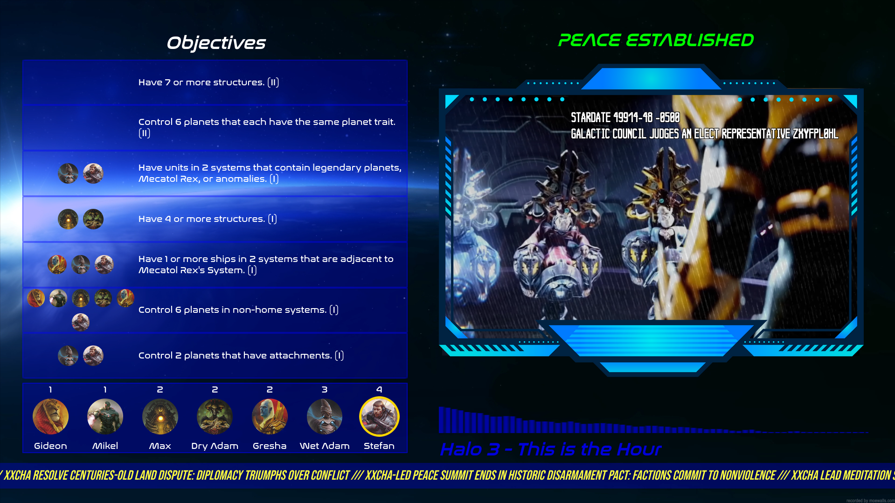

# ImmersiveTableTop

A web companion for tabletop gamers. Allows for immersive dashboards to appear on a big screen near the tabletop game, as well as a leaderboard to track game sessions.

Currently supported games:

- Twilight Imperium Fourth Edition
- Frosthaven (WIP)
- Blood Bowl (WIP)
- Root (WIP)
- Risk 2210 AD (WIP)

## Twilight Imperium Fourth Edition (Including the Prophecy of Kings Expansion)

Some features included in the TI4 module include:

- Public Objectives Tracking
- Scoreboard
- Music Player
- Video Player
- News Reel
- Peace/War Mode
- Log Viewer
- Admin Panel

This module is meant to be set in fullscreen mode on a 16:9 screen.

### Public Objectives and Agendas Tracking

A semi-transparent pane shows all the currently active public objectives, as well as which players have scored the objectives. Objectives have either a '(I)', or '(II)' at the end to specify their tier. These objectives can be added/removed in the admin panel, as well as which objectives a player has scored.

Once agendas start being passed, they can be added to the agendas pane, which swaps out with the objectives pane every few seconds. The Objectives pane stays for 10 seconds + 5 seconds for each objective added. The Agendas pane stays for 5 seconds + 10 seconds for each agenda added.

### Scoreboard

A semi-transparent bar shows all the players and their current score. Score needs to be manually added/removed in the admin panel. Players in first place get a gold border around their faction icon. Players tied for first (up to a 3-way tie) get a silver border around their faction icon.

### Music Player

A music player with a visualizer that moves with the song, and a currently playing song text object that displays the currently playing song. All loaded songs can be viewed in the admin panel, and specific songs can queued to override the current playing song.

### Video Player

A video player in a frame object that plays random video clips in a .mp4 format. These clips are meant to look like bodycam/news footage, and are categorized by "Peace", and "War" videos, playing in the respective game state.

Between each clip, a random-length pause happens, where a "no signal" gif plays. Once the pause ends and a new video clip plays, an overlay is displayed over the clip, introducing a bit of white noise and some camera UI elements, such as the "Live" text object.

For best results, use videos with a 22:13 aspect ratio, and a 24 FPS framerate. Name the clips in a way that may resemble what would happen in the TI universe. For example, if you were to use the Call of Duty Advanced Warfare Battle of Earth cutscene as one of the clips, renaming it something like "MECATOL REX PDS HACKED.mp4" may be more immersive (capitalization and other text modifications is up to your preference). Video filenames are displayed in the video player as part of the `right-frame-filter` UI elements.

Some ideas for getting videos include:

- Call of Duty: Infinite Warfare
- Call of Duty: Advanced Warfare
- Halo 2: Anniversary Edition
- Star Wars Movies
- The Expanse
- Armored Core

### News Reel

At the bottom of the dashboard, a news reel scrolls fake news headlines from right to left. The headlines are categorized by "Peace" and "War" headlines. Headlines are read from the `static/data/TI4/sourcetexts-peace.txt` and `static/data/TI4/sourcetexts-war.txt` files.

### Peace/War Mode

When the game starts, it is in "Peace" mode. This means that no players have fought each other yet, and everyone is doing their own thing, trying to complete the public objectives without conflict. However, sooner or later a player becomes the aggressor, and starts a fight with another player. When this happens, the admin can change the dashboard to "War" mode, signifying the start of conflict in the universe; the end of the "cold" war. This change can be done from the admin panel, and will log the time before the first shot was fired in the leaderboard once the game has finished.

### Log Viewer

A logger that logs actions done by the admin, such as changing a players score, or adding a new public objective. These logs can be seen from the admin panel. Logs will show the time when the action was performed, which private IP address the action came from, and will highlight any important words such as "score".

### Admin Panel

The admin panel allows an administrator to change various elements in the dashboard while the game is running.

#### Game Data

Administrators can change between the `Peace` and `War` modes.

#### Players

Administrators can add/remove players to the game, change their names, scores, which objectives they've completed, and secret objectives.

#### Objectives and Agendas

Administrators can add or remove specific public Objectives and Agendas, or add random ones.

#### Music

Administrators can override which song is currently playing by choosing from the list of available music.

#### Log

Administrators can view the log of administrative actions that have been recently performed.

#### Reset Game

Administrators can reset the game, which removes all players, public objectives, agendas, and resets the game state back to "Peace".

### API

openapi file coming soon TM

# Immersive Table

This part of the project is still being brainstormed. The idea is to have a face-up display, inside of a table acting as the game board. As the game board, players would place supplementary pieces on the display as they would on a game board.

This lets users select many different types of game boards, such that dont have a physical game mat or board.

Some things under consideration are:

- Should the display have touchscreen capabilities?
  - Games that have metal pieces may unintentionally touch parts of the screen?
- Should there be a textured film/cover on top of the display to not damage it and make it feel better?
  - Games that have metal pieces may damage the screen
- What viewing angles does the display need in order for all the players to see it well?
- How big should the display be?
  - Imagine big games with large player sizes like Twilight Imperium with 8 players
  - 32" and 40" and pretty common sizes for TVs
  - check aspect ratio. Maybe there are non-16:9 displays
- How much space on the borders of the table should be left for players to put the games pieces?
- Should the table be at regular height, or bar height?
- Should each seat at the table have something like a stream deck, and/or small screen that only the player can see? I imagine it would show player specific stats, and needs an on/off button to prevent bleeding.
- Distance between two people sitting at the table should be about ~2 meters
